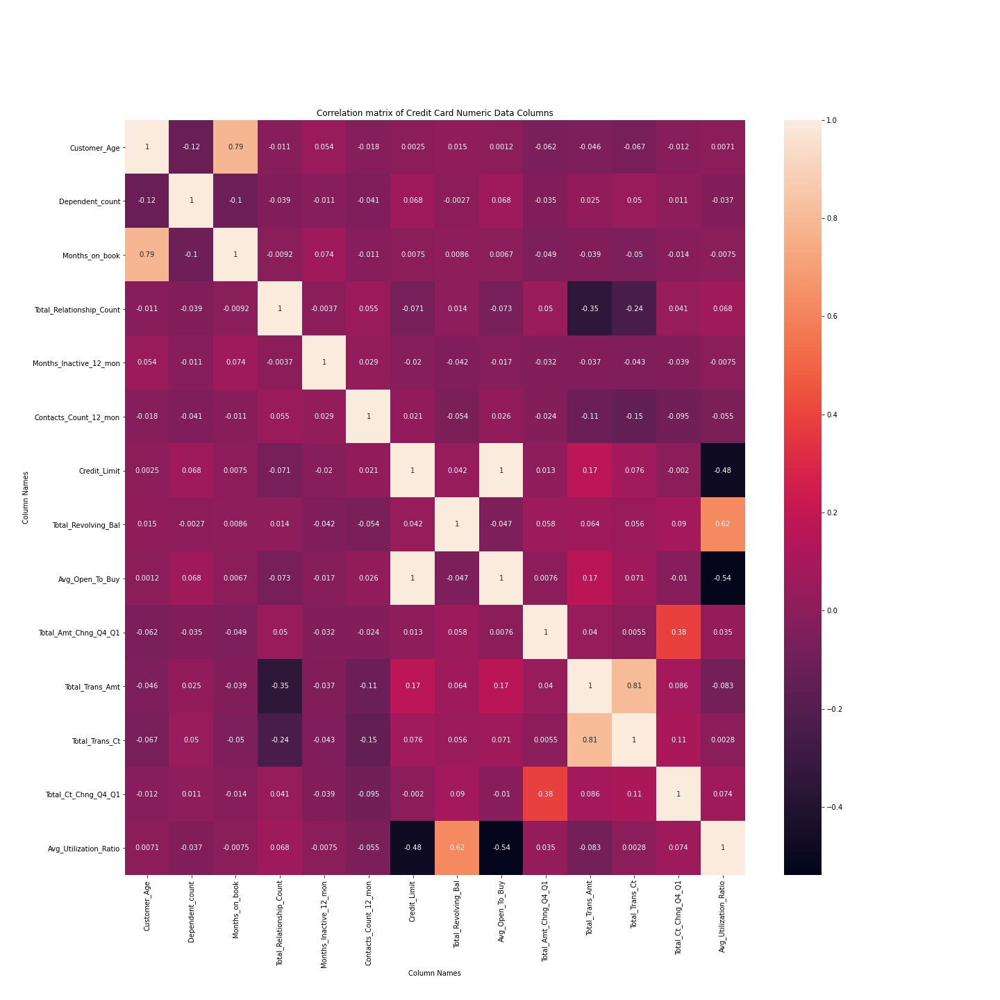
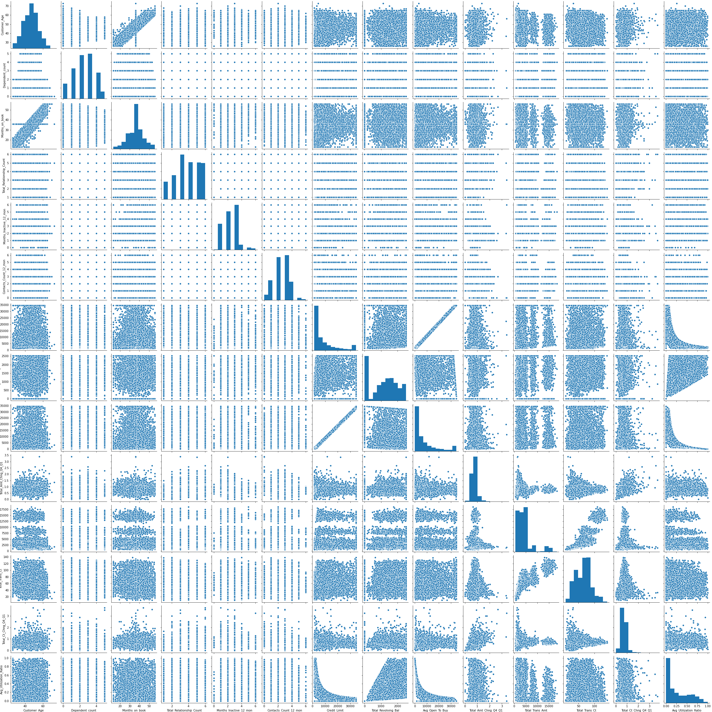
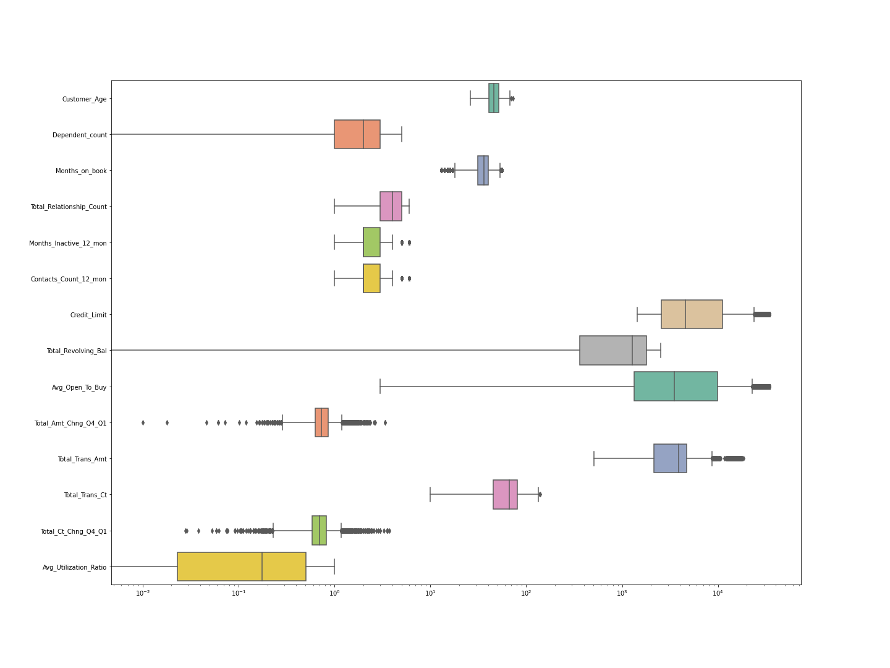
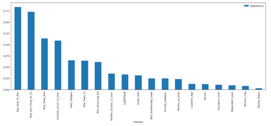

# Machine Learning - Credit Card Churn

## Background

Customer churn is one of the biggest challenges for any business. It can be difficult for established businesses with a broad customer base to identify customers at risk. In this project, we used a dataset of credit card customers to develop a **machine learning** model that predicts if a customer is going to leave or stay with the business.

## The Final App

The Credit Card Churn Predictor can be found here:

**https://project3-bank-churning.herokuapp.com/**

## Contributors
* Swobabika Jena (https://github.com/SwobabikaJena)
* Diana Madonko (https://github.com/DMadonko)
* Thomas Maina (https://github.com/1418tm-data)
* Jason Sutton (https://github.com/jMacProd)
* Will Bobzin (https://github.com/GBobzin)
* Franz Kiel (https://github.com/Franz365)

## Dataset

[Our dataset](https://www.kaggle.com/sakshigoyal7/credit-card-customers) consists of 10,000 existing and attrited customers. It includes 23 columns including their age, salary, marital_status, credit card limit, credit card category, etc.

## Data Exploration

We started the data exploration with a univariate analysis and visualised it in an [interactive Tableau dashbord](https://public.tableau.com/profile/franz.kiel#!/vizhome/Credit_Card_Churn/CreditCardChurn):

We further conducted bi-variate analysis, missing value treatment, and outlier treatment using Python in a [Jupyter Notebook](01%20Data%20Exploration/Multivariate_analysis.ipynb). Here are some of the results:

- Correlation Matrix

- Pairplots

- Boxplot Outliers

## Feature Engineering

The feature engineering was done using Python in [this Jupyter Notebook](03%20Feature%20Engineering/01%20Feature%20Engineering%20-%20Converting%20categorical%20features%20to%20numerical.ipynb).

### Ordinal Categorical Features

- Education_Level
- Income Category
- Card_Category

### Non-Ordinal Categorical Features

- Gender
- Marital_Status
- ...

## Pre-Processing

After the feature engineering we did the following pre-processing steps:

- Split data into X (features) and Y (classes)
- Split data into Train and Test data
- Label Encoding Y classes
- One-hot encoding
- MinMaxScaling for continual features

## Machine Learning Model

We built the following 4 machine learning models with the corresponding scores:

1. [Decision Tree](05%20Machine%20Learning%20Models/01%20ML%20Model%20-%20Tree%20-%20Random%20Forest%20Model.ipynb) – Score 0.937
2. [Random Forest](05%20Machine%20Learning%20Models/01%20ML%20Model%20-%20Tree%20-%20Random%20Forest%20Model.ipynb) – Score 0.962
3. [Logistic Regression](05%20Machine%20Learning%20Models/LogisticRegression.ipynb) – Score 0.88
4. [K Nearest Neighbour](05%20Machine%20Learning%20Models/KN_Test.ipynb) – Score 0.9

As the Random Forest model achieved the highest test scores, we decided to implement it in our final app.

### Potential Improvements

Redusing the number of imput features to the important ones.

## Technologies
- Pandas
- Seaborn
- Matplotlib
- Tableau Public
- Scikit Learn
- Statsmodels
- Numpy
- Tensorflow
- Pickle
- Python Web Flask
- HTML
- JavaScript
- CSS
- D3.js
- Bootstrap
- Herokuapp

## Navigating the repository
- app.py
- models.py
- Procfile
- requirements.txt

**01 Data Exploration**
- Multivariate_analysis.ipynb

**02 Data Clean - Deleted - not required**

**03 Feature Engineering**
- 01 Feature Engineering - Converting categorical features to numerical.ipynb
- bankchurnersencoded.csv *- Output*
- label_encoderGender.pkl *- Output*

**04 Pre-processing Template**
- 01 Pre-processing- X-Y split - Y One-Hot Encoding - Train-Test Split - Scaling X Training Data.ipynb
- X_scaler.pkl *- Output*

**05 Machine Learning Models**
- 01 ML Model - Tree - Random Forest Model.ipynb
- KN_Test.ipynb
- LogisticRegression.ipynb
- randomforest_model_trained.sav *- Output*

**Data**
- BankChurners.csv - *Original Data*
- BankChurners_cleaned.csv *- Output*
- TestBulkData.csv *- Prepared data for use in Keroku app*

**Static**
- **css**
    - styles.css

- **js**
     - app.js

**templates**
- index.html

## Resources

- https://heartbeat.fritz.ai/a-practical-guide-to-feature-engineering-in-python-8326e40747c8

- Importing CSV and converting to numpy array - https://intellipaat.com/community/9398/how-do-i-read-csv-data-into-a-record-array-in-numpy#:~:text=To%20read%20CSV%20data%20into,the%20delimiter%20to%20a%20comma.&text=You%20can%20also%20use%20the,a%20record%20array%20in%20NumPy.&text=df.

- Code to scale specific features - https://www.codegrepper.com/code-examples/python/can+i+scale+certain+columns+in+my+pandas+dataframe%3F

 - https://www.thepythoncode.com/article/extracting-and-submitting-web-page-forms-in-python
 
- https://stackoverflow.com/questions/47380663/numpy-reverse-keras-to-categorical

- https://scikit-learn.org/stable/modules/generated/sklearn.preprocessing.LabelEncoder.html

- https://mljar.com/blog/save-load-random-forest/

- https://pythonise.com/series/learning-flask/flask-and-fetch-api
