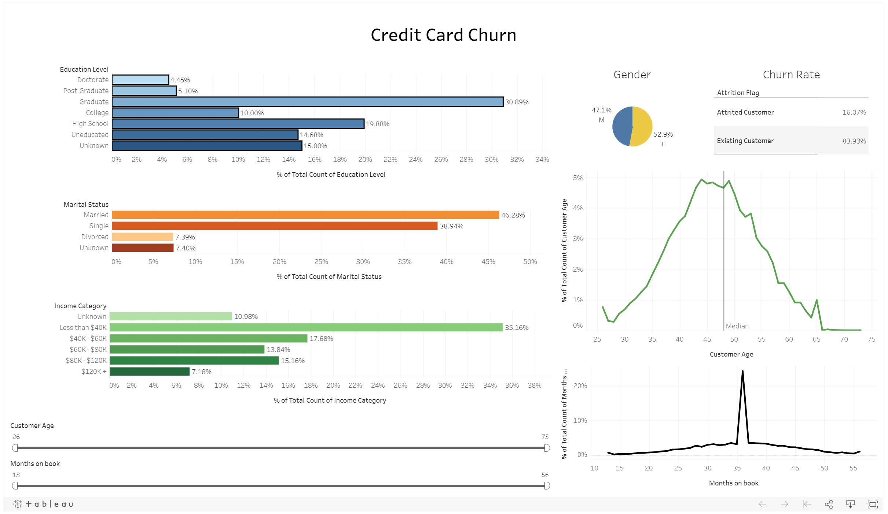

# Machine Learning Project - Credit Card Churn

## Background

Customer churn is one of the biggest challenges for any business. It can be difficult for established businesses with a broad customer base to identify customers at risk. In this project, we used a dataset of credit card customers to develop a **machine learning** model that predicts if a customer is going to leave or stay with the business.

## Dataset

[Our dataset](https://www.kaggle.com/sakshigoyal7/credit-card-customers) consists of 10,000 existing and attrited customers. It includes 23 columns including their age, salary, marital_status, credit card limit, credit card category, etc.

## Data Exploration

We started the data exploration with a univariate analysis and visualised it in an [interactive Tableau dashbord](https://public.tableau.com/profile/franz.kiel#!/vizhome/Credit_Card_Churn/CreditCardChurn):

We further conducted bi-variate analysis, missing value treatment, and outlier treatment using Python in a [Jupyter Notebook](01%20Data%20Exploration/Multivariate_analysis.ipynb). Here are some of the results:

- Correlation Matrix

- Pairplots

- Boxplot Outliers

## Feature Engineering

The feature engineering was done using Python in [this Jupyter Notebook](03%20Feature%20Engineering/01%20Feature%20Engineering%20-%20Converting%20categorical%20features%20to%20numerical.ipynb).

### Ordinal Categorical Features

- Education_Level
- Income Category
- Card_Category

### Non-Ordinal Categorical Features

- Gender
- Marital_Status
- ...

## Pre-Processing

After the feature engineering we did the following pre-processing steps:

- Split data into X (features) and Y (classes)
- Split data into Train and Test data
- Label Encoding Y classesOne-hot encoding

## Machine Learning Model

We built the following 4 machine learning models with the corresponding scores:

1. [Decision Tree](05%20Machine%20Learning%20Models/01%20ML%20Model%20-%20Tree%20-%20Random%20Forest%20Model.ipynb) – Score 0.937
2. [Random Forest](05%20Machine%20Learning%20Models/01%20ML%20Model%20-%20Tree%20-%20Random%20Forest%20Model.ipynb) – Score 0.962
3. [Logistic Regression](05%20Machine%20Learning%20Models/LogisticRegression.ipynb) – Score 0.88
4. [K Nearest Neighbour](05%20Machine%20Learning%20Models/KN_Test.ipynb) – Score 0.9

As the Random Forest model achieved the highest test scores, we decided to implement it in our final app.

## The Final App

The Credit Card Churn Predictor can be found here:

https://project3-bank-churning.herokuapp.com/
